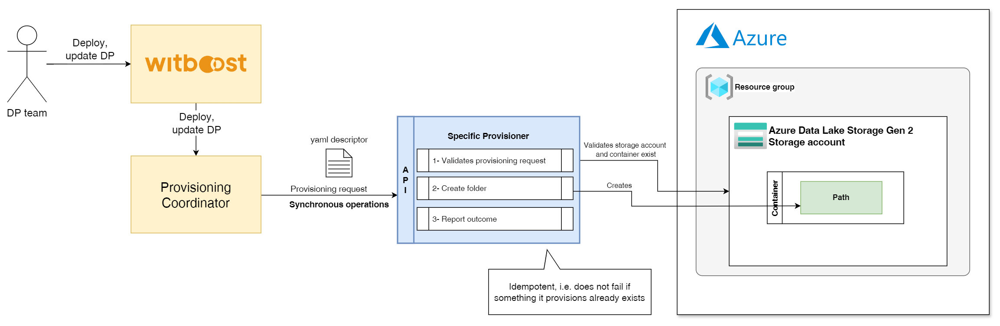

# High Level Design

This document describes the High Level Design of a module that handles Azure ADLS Gen2 Storage using the Terraform Specific Provisioner.
The source diagrams can be found and edited in the [accompanying draw.io file](hld.drawio).

## Overview

### Specific Provisioner

A Specific Provisioner (SP) is a service in charge of performing a resource allocation task, usually through a Cloud Provider. The resources to allocate are typically referred to as the _Component_, the details of which are described in a YAML file, known as _Component Descriptor_.

The SP is invoked by an upstream service of the Witboost platform, namely the Coordinator, which is in charge of orchestrating the creation of a complex infrastructure by coordinating several SPs in a single workflow. The SP receives the _Data Product Descriptor_ as input with all the components (because it might need more context) plus the id of the component to provision, named _componentIdToProvision_

To enable the above orchestration a SP exposes an API made up of five main operations:
- validate: checks if the provided component descriptor is valid and reports any errors
- provision: allocates resources based on the previously validated descriptor; clients either receive an immediate response (synchronous) or a token to monitor the provisioning process (asynchronous)
- status: for asynchronous provisioning, provides the current status of a provisioning request using the provided token
- unprovision: destroys the resources previously allocated.
- updateacl: grants access to the component for Witboost users/groups

### Azure ADLS Gen 2

Azure Data Lake Storage Gen2 is a set of capabilities dedicated to big data analytics, built on Azure Blob Storage.

A data lake is a single, centralized repository where you can store all your data, both structured and unstructured. A data lake enables your organization to quickly and more easily store, access, and analyze a wide variety of data in a single location. With a data lake, you don't need to conform your data to fit an existing structure. Instead, you can store your data in its raw or native format, usually as files or as binary large objects (blobs).

### Azure ADLS Gen 2 Output Port Specific Provisioner

Azure ADLS Gen 2 Output Port Specific Provisioner is used to provision an output port on top of a Azure ADLS Gen 2 data lake.

#### Validate

This Specific Provisioner interacts with the Azure environment by creating a path (i.e. a folder) into a container of the `ADLS Gen 2 storage account`. Therefore, the validation checks that both the Storage Account and the container are in place.

#### Provision

The provisioning phase creates the path into the container of the storage account, if it doesn't exist yet.

#### UpdateACL

The authorization layer mixes RBAC roles and ACLs.
Appropriate permissions for the `Data Product Owner` and `Dev Group` are inherited from the storage account itself, managed via RBAC.
Consumers, on the other hand, are managed via ACLs at path and container level: for an entity to have access to a specific path, it must have traversal access (`+x`) on all the parent entities, up to the container itself. On the path itself, read permission (`+rx`) is also assigned.

#### Unprovision

During the unprovisioning phase, the specific provisioner wipes the assigned ACLs on the path. If the `removeData` flag is true, the provisioned path is also removed.

